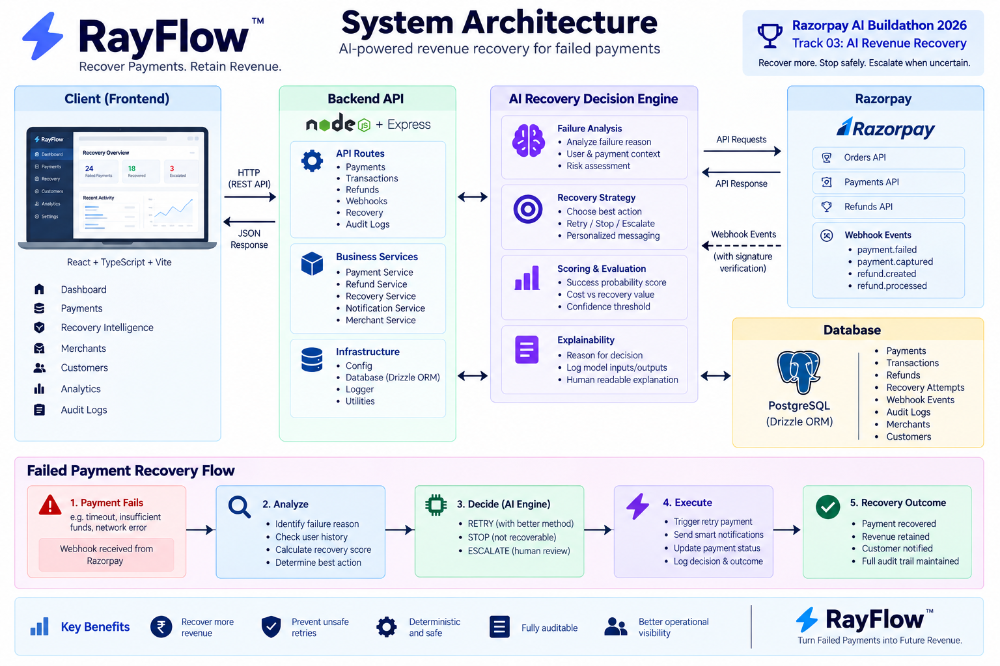

# RayFlow

> AI-powered revenue recovery for failed payments, built for Razorpay AI Buildathon — Track 03: AI Revenue Recovery.




RayFlow is a payment recovery and operations platform that detects revenue at risk from payment failures, evaluates the safest recovery action, executes bounded recovery workflows, and measures the outcome with a complete audit trail.

The core idea is simple:

**Detect → Decide → Recover → Measure → Audit**

---

## 🎯 Razorpay AI Buildathon — Track 03

RayFlow is designed around the **AI Revenue Recovery** problem.

When a payment fails, blindly retrying every transaction can create unnecessary payment attempts, customer friction, and operational risk.

RayFlow instead evaluates each failed payment and determines whether to:

- **RETRY** — attempt a bounded recovery action when the failure is likely recoverable
- **STOP** — prevent further automated attempts when recovery is unsafe or unlikely
- **ESCALATE** — send uncertain cases for manual review

The recovery decision is combined with safety rules and a deterministic state machine so that the decision engine cannot bypass critical payment safeguards.

### Core principle

> **The goal is not to retry more payments. The goal is to recover more revenue safely.**

---

## 🚀 What RayFlow Does

RayFlow provides a centralized payment operations workflow covering:

**Payment → Verification → Transaction Tracking → Recovery → Refund → Reconciliation → Audit**

The most important workflow is failed-payment recovery:

```text
Failed Payment
      │
      â–¼
Recovery Intelligence
      │
      ├── RETRY ──────► Bounded Recovery Attempt
      │                       │
      │                       ▼
      │                  Recovered Revenue
      │
      ├── STOP ───────► Automation Blocked
      │
      └── ESCALATE ──► Manual Review

      🧠 Recovery Intelligence

RayFlow includes an explainable recovery decision engine that evaluates failed payment attempts using signals such as:

Failure code
Previous failed attempts
Payment method
Transaction amount
Retry safety
Recovery likelihood

The engine produces:

Recovery action
Recovery score
Recovery probability
Expected recovery amount
Risk level
Recovery strategy
Recovery priority
Human-readable reason
Decision signals
Automation status
Example: Recoverable Failure
Failure:
TIMEOUT

Recovery Action:
RETRY

Recovery Score:
94 / 100

Recovery Probability:
94%

Expected Recovery:
₹9,400

Risk:
LOW

Strategy:
IMMEDIATE RETRY

Priority:
HIGH

Automation:
Allowed
Example: Protected Failure
Failure:
INSUFFICIENT_FUNDS

Recovery Action:
STOP

Risk:
HIGH

Strategy:
STOP RECOVERY

Priority:
LOW

Automation:
Blocked

This demonstrates both sides of revenue recovery:

recover when it is safe, and stop when it is not.

🛡️ Safety & Recovery Guardrails

Revenue recovery should not become uncontrolled payment retrying.

RayFlow uses bounded recovery rules to prevent unsafe automation.

Key Safeguards
Maximum automated retry limit
Explicit retryable vs non-retryable failure handling
Payment state transition validation
STOP decisions remain authoritative
Unknown failures are escalated instead of blindly retried
Recovery decisions are auditable
Recovery actions are deterministic and bounded
Final payment state is controlled by the payment state machine
Decision Architecture

The recovery intelligence recommends an action, but the deterministic workflow acts as the final safety gate.

                Recovery Intelligence
                         │
                         â–¼
                Recommended Action
                         │
                         â–¼
              Safety / State Machine
                         │
          ┌──────────────┼──────────────┐
          â–¼              â–¼              â–¼
        RETRY           STOP         ESCALATE
          │              │              │
          â–¼              â–¼              â–¼
     Recovery       Automation       Manual
      Workflow        Blocked         Review

This separation prevents the decision engine from directly overriding critical payment-state rules.

📊 Recovery Measurement

RayFlow tracks the financial impact of recovery decisions instead of measuring success only by the number of retries.

The recovery intelligence includes:

Recovery probability
Expected recovery amount
Recovered amount
Recovery outcomes
Recovery success rate
Retry vs stop decisions
Recent recovery activity

This makes it possible to evaluate recovery performance across a batch of failed payments.

Example
Failed Revenue at Risk      ₹25,000
Recovered Revenue           ₹18,000
Recovery Rate                    72%
Automated Recoveries             4
Protected / Stopped Cases        3
Manual Escalations               1
🔄 Recovery Simulation

RayFlow includes a controlled recovery simulation/provider abstraction for demonstrating the complete recovery workflow without making uncontrolled live payment attempts.

The simulation demonstrates:

Failed Payment
      ↓
Recovery Decision
      ↓
Safety Validation
      ↓
Bounded Recovery Attempt
      ↓
Payment Result
      ↓
Recovered / Protected / Escalated
      ↓
Audit Log

The provider layer is replaceable, allowing a real payment-provider integration to be introduced without coupling the recovery decision engine directly to provider-specific behavior.

💳 Payment Management

RayFlow provides visibility into the payment lifecycle.

Features include:

Payment transaction monitoring
Payment status tracking
Payment attempt tracking
Payment verification
Payment state management
Razorpay order/payment integration

Payment attempts use explicit states:

created
   ↓
processing
   ↓
success

or

processing
   ↓
failed
   ↓
processing

Invalid state transitions are rejected by the payment state machine.

💰 Refund Management

RayFlow also handles refund operations and keeps refund state synchronized with Razorpay webhook events.

Features include:

Refund creation
Refund tracking
Pending, successful and failed refund states
Refund status updates
Refund amount validation
Safe refund state transitions
Protection against invalid state regressions
🔔 Razorpay Webhooks

RayFlow processes Razorpay refund webhook events:

refund.created
refund.processed
refund.failed

Webhook processing includes:

Razorpay signature verification
Event ID based idempotency
Refund identification through Razorpay notes
Refund amount validation
Safe state transitions
Audit logging
Duplicate-event protection

The webhook workflow prevents the same event from being processed multiple times and protects finalized refund states from invalid regressions.

🧾 Audit Trail

Important payment, refund, webhook, and recovery events are recorded in an audit log.

Recovery-related events can capture information such as:

Order
Attempt
Failure Code
Recovery Action
Recovery Strategy
Recovery Priority
Recovery Score
Risk Level
Automation Status
Outcome
Timestamp

This provides traceability for:

Why a recovery action was selected
Whether automation was allowed
What happened after the decision
Whether revenue was recovered
Why a case was stopped or escalated
📈 Dashboard

The RayFlow dashboard provides operational visibility into:

Payments
Transactions
Refunds
Recovery
Recovery Intelligence
Merchants
Customers
Audit activity

The Recovery Intelligence view highlights the latest decisions and makes the reasoning behind each decision visible to operators.

🏗️ Architecture
                         ┌──────────────────────┐
                         │      RayFlow Web     │
                         │ React + TypeScript   │
                         └──────────┬───────────┘
                                    │
                                    â–¼
                         ┌──────────────────────┐
                         │     Express API      │
                         │      REST Routes     │
                         └──────────┬───────────┘
                                    │
             ┌──────────────────────┼──────────────────────┐
             │                      │                      │
             â–¼                      â–¼                      â–¼
   ┌──────────────────┐   ┌──────────────────┐   ┌──────────────────┐
   │ Recovery         │   │ Payment State    │   │ Razorpay         │
   │ Decision Engine  │   │ Machine          │   │ Webhooks         │
   └────────┬─────────┘   └────────┬─────────┘   └────────┬─────────┘
            │                      │                      │
            └──────────────────────┼──────────────────────┘
                                   â–¼
                         ┌──────────────────────┐
                         │      Drizzle ORM     │
                         └──────────┬───────────┘
                                    â–¼
                         ┌──────────────────────┐
                         │     PostgreSQL       │
                         │                      │
                         │ Payments             │
                         │ Attempts             │
                         │ Transactions         │
                         │ Refunds              │
                         │ Webhook Events       │
                         │ Audit Logs            │
                         └──────────────────────┘
Recovery Flow
Payment Failure
      │
      â–¼
Recovery Route
      │
      â–¼
Recovery Decision Engine
      │
      ├──────── RETRY
      │           │
      │           ▼
      │     Safety Validation
      │           │
      │           ▼
      │     Recovery Provider
      │           │
      │           ▼
      │     Recovery Outcome
      │
      ├──────── STOP
      │           │
      │           ▼
      │     Automation Blocked
      │
      └────── ESCALATE
                  │
                  â–¼
             Manual Review

                  │
                  â–¼
              Audit Log
🛠️ Tech Stack
Frontend
React
TypeScript
Vite
CSS
Backend
Node.js
Express
TypeScript
Database
PostgreSQL
Drizzle ORM
Payment Gateway
Razorpay APIs
Razorpay Webhooks
Development
Git
GitHub
PowerShell
VS Code
📁 Project Structure
rayflow/
├── apps/
│   ├── api/
│   │   ├── src/
│   │   │   ├── config/
│   │   │   ├── infrastructure/
│   │   │   ├── routes/
│   │   │   └── services/
│   │   ├── scripts/
│   │   ├── test/
│   │   └── package.json
│   │
│   └── web/
│       ├── src/
│       │   ├── pages/
│       │   ├── assets/
│       │   └── App.tsx
│       └── package.json
│
├── package.json
├── package-lock.json
└── .gitignore
⚙️ Getting Started
Prerequisites

Make sure the following are installed:

Node.js
npm
PostgreSQL
Git
Install Dependencies

From the project root:

npm install
Configure Environment Variables

Create the required environment configuration for the API.

Typical configuration includes:

DATABASE_URL
RAZORPAY_KEY_ID
RAZORPAY_KEY_SECRET
RAZORPAY_WEBHOOK_SECRET

Use your own credentials and never commit secrets to GitHub.

Start the API
cd apps/api
npm run dev

The API runs on:

http://localhost:4000
Start the Web Application

Open another terminal:

cd apps/web
npm run dev

The web application normally runs on:

http://localhost:5173
🧪 Build Verification

Build the complete workspace with:

npm run build --workspaces

This verifies:

API TypeScript compilation
Web TypeScript compilation
Production Vite build
🎬 Suggested Demo Flow

A short demonstration can follow this sequence:

1. Open the Dashboard

Show the RayFlow payment operations dashboard.

2. Open Recovery Intelligence

Show the failed-payment recovery decisions.

3. Demonstrate a Recoverable Failure

Use a TIMEOUT failure.

Show:

RETRY
94% confidence
94% recovery probability
LOW risk
IMMEDIATE RETRY
HIGH priority
Automation Allowed
4. Demonstrate a Protected Case

Use an INSUFFICIENT_FUNDS failure.

Show:

STOP
HIGH risk
STOP RECOVERY
Automation Blocked

Explain that RayFlow deliberately avoids retrying cases where automated recovery is unsafe or unlikely to help.

5. Show Recovery Outcome

Demonstrate the bounded recovery simulation and recovered revenue.

6. Show Audit Trail

Show how the recovery decision and outcome are recorded for traceability.

7. Show Webhook Reliability

Demonstrate the refund webhook flow and duplicate-event protection.

🤖 AI / Decision Engine Note

RayFlow's current recovery intelligence is an explainable deterministic decision engine rather than a trained machine-learning model.

It evaluates payment and failure signals using bounded scoring and policy rules to produce a transparent recovery recommendation.

The architecture intentionally separates:

Decision Intelligence
        ↓
Safety Rules
        ↓
Deterministic Execution

This design can be extended later with a trained ML model or LLM-based reasoning layer while retaining the deterministic safety gate.
